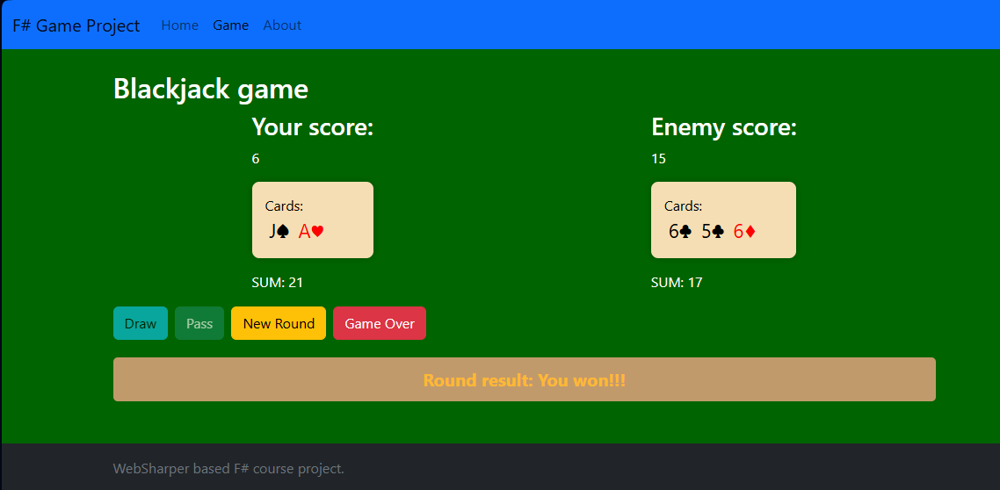

# F# Blackjack Game (21)

This is a simple implementation of the classic Blackjack (21) card game.

## Motivation

I chose this project because when I first started programming in BASIC on a Commodore 64, the very first game I made was also Blackjack. This project is a personal nostalgia in a modern programming environment.

I originally wanted to use the Commodore 64 color scheme, but later decided to use the green background color of the classic Windows Solitaire game. I ended up adding darker tones to make the visuals easier on the eyes and more battery-friendly for longer playtime.

## How it works

- Navigate to the 'Game' page from the menu.
- Start the game using the 'Start' button.
- A deck is generated and shuffled using a basic randomization function.
- At the beginning, the player draws cards, then the enemy draws, then the player again, alternating until the end of the round...
- The 'Pass' button only becomes available if the total value of the player's cards exceeds 16.
- Once upon the player passes, and the round ends, then the game calculates the scores to determine the winner.
- The 'New round' button starts a new round, generating and shuffling a new deck...
- 

Even though I was the developer, I often got defeated by the enemy. I used to think the enemy was cheating, but now I realize that I'm just unlucky in cards.

## Technical Notes

- The project was written in Visual Studio in F# and uses the WebSharper plug-in framework.
- (IntelliFactory) WebSharper 8 Client-Server Application project templates were the starting point for the development.
- For the visual style appearance, I used Boostrap v5.3, but I supplemented and modified it in some places.

